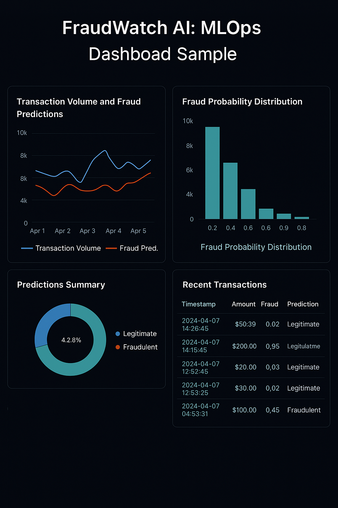

# 🛡️ FraudWatch AI: MLOps Pipeline for Real-Time Credit Card Fraud Detection

FraudWatch AI is a robust and production-ready MLOps pipeline designed to detect fraudulent credit card transactions in real time. The project simulates a scalable fraud detection system used by financial institutions, featuring model training, evaluation, deployment, CI/CD, and monitoring.




## 💼 Business Use Case

In high-volume financial environments, detecting fraudulent transactions swiftly is critical. This project replicates a real-world fintech scenario where millions of transactions are processed daily. FraudWatch AI ensures accurate fraud detection and allows for retraining models as new data streams in.

## 🧰 Tech Stack

- **Python**, **scikit-learn**, **XGBoost**
- **Flask** API for model inference
- **Docker** for containerization
- **GitHub Actions** for CI/CD
- **AWS EC2 / S3** for cloud deployment
- **DVC** for data and model version control

## 🚀 Features

- End-to-end MLOps workflow with modular codebase
- Scalable fraud detection model pipeline
- Automated retraining via CI/CD
- Containerized microservice for real-time inference
- Version tracking for experiments and models

## 👩‍💻 Maintained by

**[Harshini Pothireddy](https://github.com/harshini1708)**  
Master’s in Software Engineering (Data Science Specialization)

## 📂 Project Structure

```
fraudwatch-mlops/
│
├── src/
│   ├── dataprep/         # Data ingestion and validation
│   ├── featuretools/     # Feature engineering
│   ├── modeling/         # Training and evaluation
│   └── viztools/         # Visualizations and reporting
│
├── notebooks/            # Jupyter notebooks for exploration
├── dvc.yaml              # DVC pipeline definition
├── Dockerfile            # Container setup for inference API
├── README.md             # This file
```

---

> 📸 To use custom images:
> - Add your architecture diagram and dashboard screenshots under `docs/assets/`
> - Replace the placeholder image paths above with actual file names

